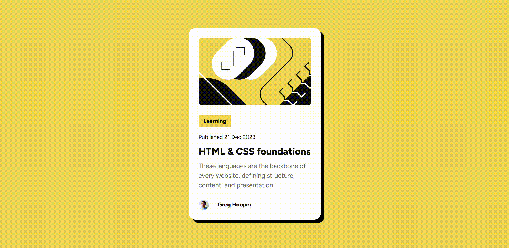

# Blog Preview Card

## Overview

This project creates a blog preview card component. The card includes hover and focus states for all interactive elements.



## Process

I began by designing the card layout in Figma, then translated the design into HTML. I styled the card using CSS Grid, custom properties, and media queries, aiming for a mobile-first approach.

### Built With

- Semantic HTML5
- CSS Custom Properties
- CSS Grid
- Mobile-First Design

### What I Learned

Working with CSS Grid was challenging as I was still familiarizing myself with its attributes. I also needed media queries to adapt the card for mobile devices. Additionally, I learned how to load static fonts:

```css
@font-face {
  font-family: 'Figtree';
  src: url('./assets/fonts/static/Figtree-ExtraBold.ttf');
  font-weight: var(--fnt-weight-extra-bold);
  font-style: normal;
}
```
Thank you for checking out my project!

This is a solution to the [Blog preview card challenge on Frontend Mentor](https://www.frontendmentor.io/challenges/blog-preview-card-ckPaj01IcS). 